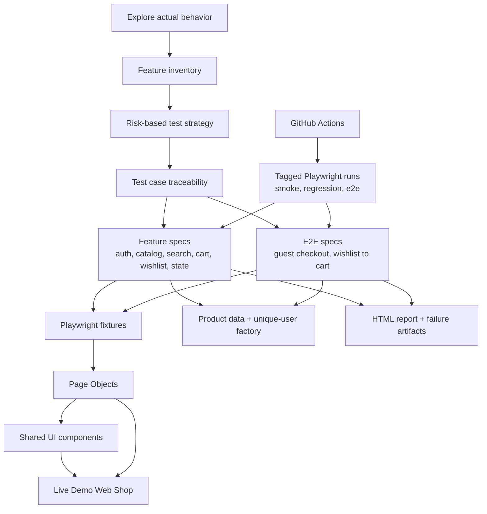

# Demo Web Shop QA Automation

Playwright and TypeScript tests for the live [Tricentis Demo Web Shop](https://demowebshop.tricentis.com/). The project shows how exploratory findings become focused, maintainable checks of an e-commerce journey.



The entry points are [feature inventory](docs/feature-inventory.md) for what the site does, [test strategy](docs/test-strategy.md) for why these checks were chosen, and [test cases](docs/test-cases.md) for scenario traceability. The diagram follows that decision path into the code and its execution.

## Coverage

| Business area | Representative checks |
| --- | --- |
| Authentication | Unique-user registration, required fields, login, rejection and logout |
| Catalog and search | Category-to-product navigation, effective-price sorting, price filtering, simple and advanced search |
| Shopping state | Cart quantity and subtotal, wishlist conversion, recently viewed order, product comparison |
| Checkout | Guest purchase journey through order review; final order submission is opt-in |

Each test starts in a fresh browser context. Account tests create their own users; cart and wishlist tests create their own items. Feature tests state focused business outcomes, while `tests/e2e/` follows cross-feature journeys.

## Project Map

| Path | Responsibility |
| --- | --- |
| `tests/` | Feature specs and end-to-end workflows; assertions stay here |
| `pages/` | Meaningful page actions and locators |
| `components/` | Reused header and product-card behavior |
| `fixtures/` | Typed Playwright dependencies injected into tests |
| `data/` | Known product examples in one place |
| `utils/` | Unique-user factory and price parsing |
| `docs/` | Exploration, priorities and test traceability |
| `playwright.config.ts` | Browser, retries, reporting and artifacts |
| `.github/workflows/playwright.yml` | CI smoke run and manually selected suites |

## Run Locally

Requires Node.js 22 or newer.

```bash
npm ci
npx playwright install chromium
npm test
```

| Command | Purpose |
| --- | --- |
| `npm run test:smoke` | Fast critical-path suite |
| `npm run test:regression` | Focused feature suite |
| `npm run test:e2e` | Cross-feature journeys; final order submission skips by default |
| `npm run test:headed` | Watch Chromium execute |
| `npm run test:ui` | Open the Playwright test UI |
| `npm run typecheck` | Check strict TypeScript types |
| `npm run report` | Open the latest HTML report |

To submit a test order on the **public demo shop**, explicitly opt in with `RUN_ORDER_TESTS=1 npm run test:e2e`. The checkout test uses Cash On Delivery and no payment-card data. Keep this run infrequent; normal local and CI runs stop at order review.

## Reports And CI

Playwright writes its HTML report to `playwright-report/`. Failed tests retain screenshots and traces in `test-results/`. GitHub Actions runs Chromium smoke checks on pushes and pull requests, supports manual suite selection, and uploads report artifacts after every run.

The public site can change products, prices or availability. Known examples live in `data/products.ts`; the suite checks visible outcomes rather than private application state. Newsletter, poll, reviews and deeper account management were left out so the suite stays focused on shopping behavior.
